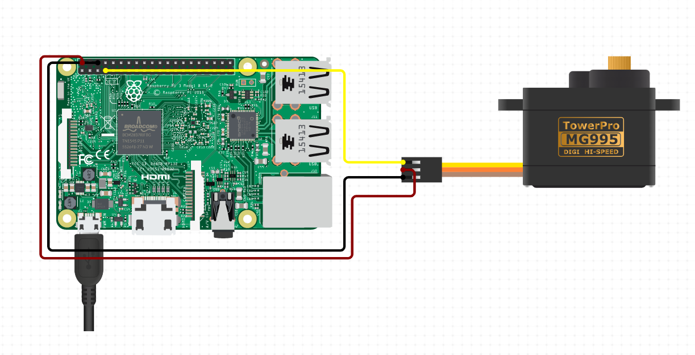

# :japanese_castle: **Castle-Black** :japanese_castle:

Hey there!! Welcome to project ***castle-black***! Glad you stumbled upon this repository. This is [MDG](https://github.com/mdgspace)'s wifi operated door lock.

## Setup

### Hardware 

#### Requirements

- [Rasberry Pi (Model 3B or higher) and power adapter](https://www.electronicscomp.com/raspberry-pi-4-model-b-with-8-gb-ram-india?gclid=CjwKCAjw7eSZBhB8EiwA60kCW0qhq6EStEe87ujPumpHq-oMfugy2OVy073pQwoRsmG0gBox0p6a-RoCMGgQAvD_BwE)
- [MG 995 Servo Motor](https://www.electronicscomp.com/mg995-metal-gear-servo-motor-180-degree-rotation?gclid=CjwKCAjw7eSZBhB8EiwA60kCWy0dw-sa8zO4HUIYlPCW9BUdMRFZhTeFG29W3qBl_jj23rjM4IXmShoCzfYQAvD_BwE)
- [M-F Jumper Wires](https://www.electronicscomp.com/male-to-female-jumper-wires-20cm-40-pieces-pack?gclid=CjwKCAjw7eSZBhB8EiwA60kCW1Bt0MqQ-NOXK26Y1HO8fxrP1NXljOsHE-y9XC490Ht0ESZTgRi7zRoCGlcQAvD_BwE)
- Custom 3D printed lock attachment

#### Circuit Diagram



### Software

In the rasberry pi, follow these steps:

#### 1. Cloning the repository
```sh
$ git clone https://github.com/Abhijna-Raghavendra/castle-black.git
$ cd castle-black
```
#### 2. Creating and activating your virtual environment
```sh
$ python3 -m venv virtenv
$ source virtenv/bin/activate
```

#### 3. Setting a secret key
```sh
(virtenv)$ openssl rand -base64 64
```
This will give you a randomly generated secret key. Now create a '.env' file at the root of your project based on '.env.example' and put in your secret key.

#### 4. Install the required dependencies
```sh
(virtenv)$ pip install -r requirements.txt
```

#### 5. Run the app
```sh
(virtenv)$ python app.py
```
Now, the flask server is hosted on {Rasberry Pi's IP}:5000 and all devices on this network should be able to view it. 

> To register new users, add in the usernames and password SHAs in the passwords sheet of sheet.xlsx. Till then, try using the credentials :  
> ```username = orange```  
> ```password = creator```  
> **Don't forget to change this password before deploying the project**

## Features

- Devices on the same network can open the wifi operated door lock
- User authentication
- Maintains user log

***If you like this project, do give the repo a star!! :star: Enjoy safeguarding your homes!!***